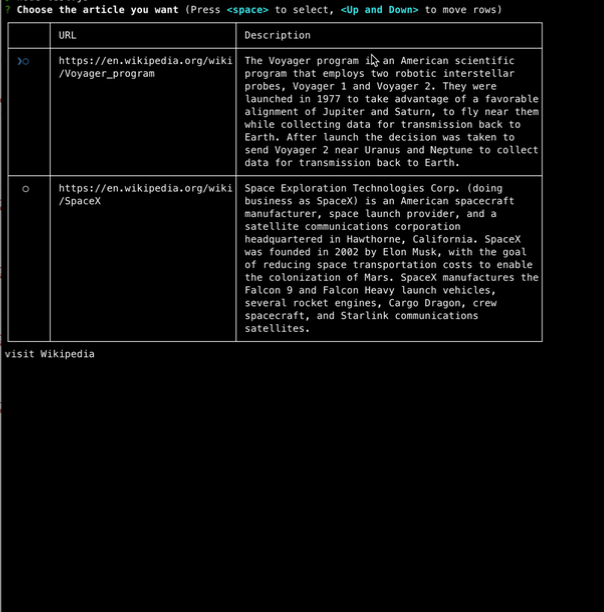

# inquirer-table-checkbox

[](https://npmjs.org/package/@adobe/inquirer-table-checkbox)
[](https://npmjs.org/package/@adobe/inquirer-table-checkbox)

[](https://opensource.org/licenses/ISC)
[](https://codecov.io/gh/adobe/inquirer-table-checkbox/)

> A checkbox prompt (as a multi-column table) for [Inquirer.js](https://github.com/SBoudrias/Inquirer.js)
>
> Based off [inquirer-table-prompt](https://github.com/eduardoboucas/inquirer-table-prompt)



## Installation

```sh
npm install --save inquirer-table-checkbox
```

## Usage

```javascript
const inquirer = require("inquirer")
const inquirerTableCheckbox = require("@adobe/inquirer-table-checkbox")
inquirer.registerPrompt("table", inquirerTableCheckbox)

inquirer
  .prompt([
    {
      type: "table",
      name: "article",
      bottomContent: "visit Wikipedia",
      message: "Choose the article you want",
      wordWrap: true,
      pageSize: 2,
      style: { "padding-left": 1, "padding-right": 0, head: [], border: [] },
      colWidths: [30, 50],
      columns: [
        {
          name: "URL",
          wrapOnWordBoundary: false
        },
        {
          name: "Description",
          wrapOnWordBoundary: true
        }
      ],
      rows: [
        {
          value: "voyager",
          URL: "https://en.wikipedia.org/wiki/Voyager_program",
          Description:
            "The Voyager program is an American scientific program that employs two robotic interstellar probes, Voyager 1 and Voyager 2. They were launched in 1977 to take advantage of a favorable alignment of Jupiter and Saturn, to fly near them while collecting data for transmission back to Earth. After launch the decision was taken to send Voyager 2 near Uranus and Neptune to collect data for transmission back to Earth."
        },
        {
          value: "spacex",
          URL: "https://en.wikipedia.org/wiki/SpaceX",
          Description:
            "Space Exploration Technologies Corp. (doing business as SpaceX) is an American spacecraft manufacturer, space launch provider, and a satellite communications corporation headquartered in Hawthorne, California. SpaceX was founded in 2002 by Elon Musk, with the goal of reducing space transportation costs to enable the colonization of Mars. SpaceX manufactures the Falcon 9 and Falcon Heavy launch vehicles, several rocket engines, Cargo Dragon, crew spacecraft, and Starlink communications satellites.",
          disabled: true
        },
        {
          value: "starlink",
          URL: "https://en.wikipedia.org/wiki/Starlink",
          Description:
            "Starlink is a satellite internet constellation operated by SpaceX, providing satellite Internet access coverage to 40 countries. It also aims for global mobile phone service after 2023. SpaceX started launching Starlink satellites in 2019. As of September 2022, Starlink consists of over 3,000 mass-produced small satellites in low Earth orbit (LEO), which communicate with designated ground transceivers. In total, nearly 12,000 satellites are planned to be deployed, with a possible later extension to 42,000. Starlink provides internet access to over 500,000 subscribers as of June 2022."
        },
        {
          value: "adobe",
          URL: "https://en.wikipedia.org/wiki/Adobe_Inc.",
          Description:
            "Adobe Inc., originally called Adobe Systems Incorporated, is an American multinational computer software company incorporated in Delaware and headquartered in San Jose, California. It has historically specialized in software for the creation and publication of a wide range of content, including graphics, photography, illustration, animation, multimedia/video, motion pictures, and print. Its flagship products include Adobe Photoshop image editing software; Adobe Illustrator vector-based illustration software; Adobe Acrobat Reader and the Portable Document Format (PDF); and a host of tools primarily for audio-visual content creation, editing and publishing. Adobe offered a bundled solution of its products named Adobe Creative Suite, which evolved into a subscription software as a service (SaaS) offering named Adobe Creative Cloud. The company also expanded into digital marketing software and in 2021 was considered one of the top global leaders in Customer Experience Management (CXM)."
        }
      ]
    }
  ])
  .then(answers => {
    console.log(answers)
  })
```

### Table Options

| Key                | Type (default)       | Description                                                     |
|--------------------|----------------------|-----------------------------------------------------------------|
| name               | string               | the string key to use for the answers returned from the prompt  |
| bottomContent      | string               | the text to show at the bottom of the table                     |
| message            | string               | the text to show at the top of the table                        |
| wordWrap           | boolean (false)      | set to true whether to wordWrap items in the table              |
| wrapOnWordBoundary | boolean (true)       | set to false if you don't want to wrap on a word boundary.      |
|                    |                      | Only applies when wordWrap is true.                             |
| pageSize           | integer              | the number of rows to show per page                             |
| style              | object               | see https://github.com/cli-table/cli-table3 for styles to apply |
| colWidths          | array&lt;integer&gt; | size of each column in `columns`                                |
| columns            | array&lt;Column&gt;  | see [Column](#Column)                                           |
| rows               | array&lt;Row&gt;     | see [Row](#Row)                                                 |

### Column

Each Column is an object with these keys:

| Key                           | Type    | Description                                  |
|-------------------------------|---------|----------------------------------------------|
| name                          | string  | the key for the Column (to be used in a Row) |
| wordWrap (optional)           | boolean | set if you want to override the table option |
| wrapOnWordBoundary (optional) | boolean | set if you want to override the table option |

### Row

Each Row is an object with these keys:

| Key          | Type    | Description                                                                        |
|--------------|---------|------------------------------------------------------------------------------------|
| value        | any     | this is the value to be returned if the row was selected                           |
| disabled     | boolean | display the option, but do not allow the user to select it                         |
| *ColumnName* | string  | for each column `name` (see [Column](#Column) section above),                      |
|              |         | set the key as the column `name` and the value as the column contents for the row. |
